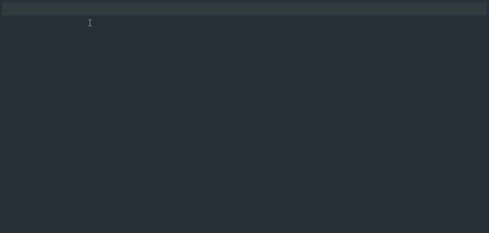

# discord.py 2.0 Snippets

This extension provides a simple set of VSCode snippets for discord.py 2.0 projects. Can be found [here on the Visual Studio Marketplace](https://marketplace.visualstudio.com/items?itemName=JohnnyJTH.discordpy-snippets).

# Snippets
| **Snippet Description**               | **Snippet Input** |
|---------------------------------------|-------------------|
| New bot with cog loading.             | `dpybot`          |
| Simple cog with setup function.       | `dpycog`          |
| Setup function for a cog.             | `dpysetup`        |
| New command in a cog.                 | `dpycommand`      |
| New embed with title and description. | `dpyembed`        |
| Add a field to an embed.              | `dpyfield`        |
| Add a footer to an embed.             | `dpyfooter`       |
| Add an author to an embed.            | `dpyauthor`       |